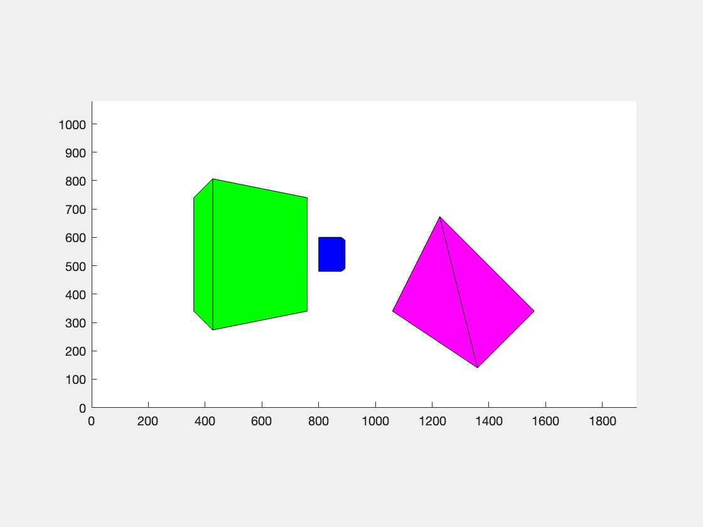

## Dolly Zoom

<figure>
    
    <figcaption>Dolly Zoom: The front two objects remains the same while the object behind is zoomed.</figcaption>
</figure>

Done as part of the [Robotics: Perception](https://www.coursera.org/learn/robotics-perception) coursework.

This project performs a Dolly Zoom effect by using the concepts of Projection and Focal Lengths. This zoom is made possible by simultaneously adjusting the focal length and moving the camera away.
