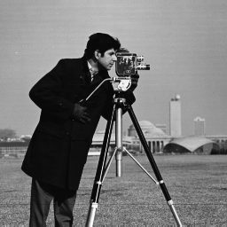
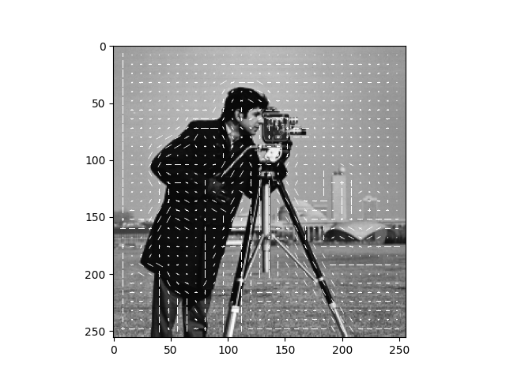
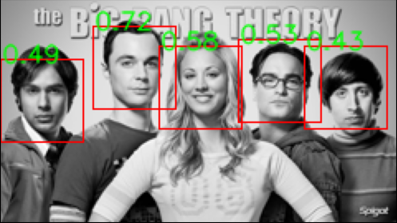

## Face Detection using HOGs

This project aims to extract the features of a face using Histogram of Gradients (HOGs) and detect faces using these features.

   
*Feature detection using HOG. Left is the original image, right is the features captured by HOG*

   
*Face detection using HOG. Left is the original image, right is the bounding boxes of the detected faces*

Done as part of the [CSCI 5561: Computer Vision](https://www-users.cse.umn.edu/~hspark/csci5561_F2020/csci5561.html) course requirements.
