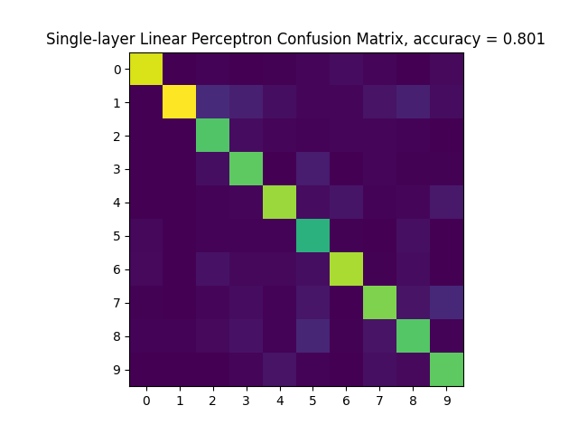
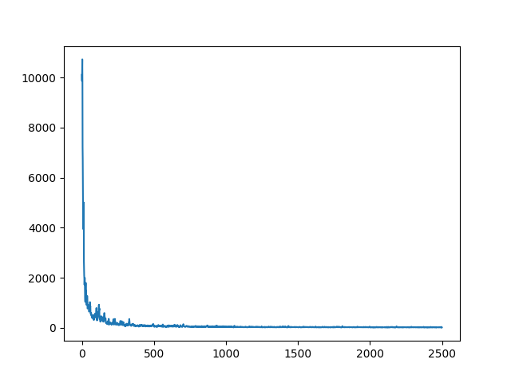
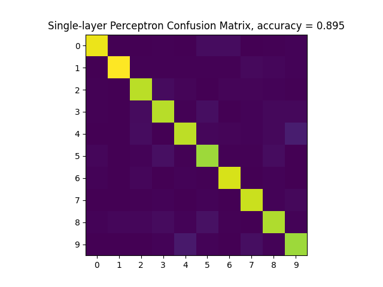
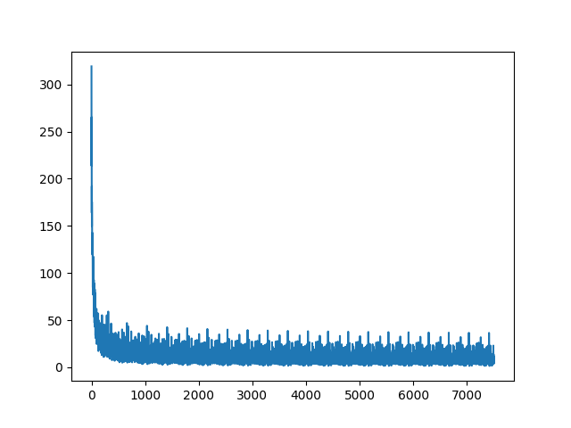
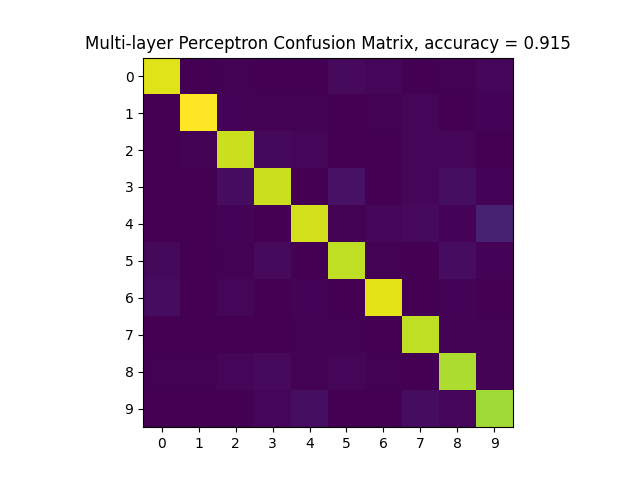
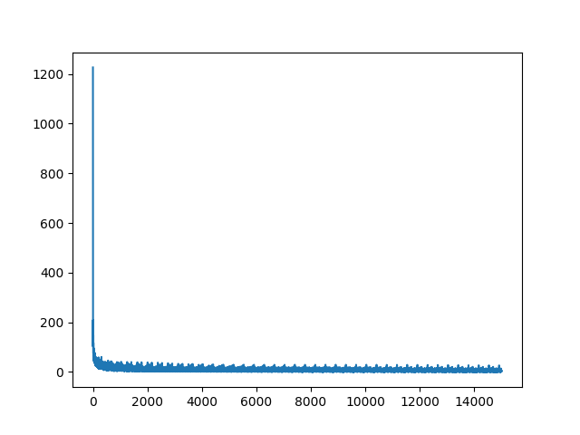
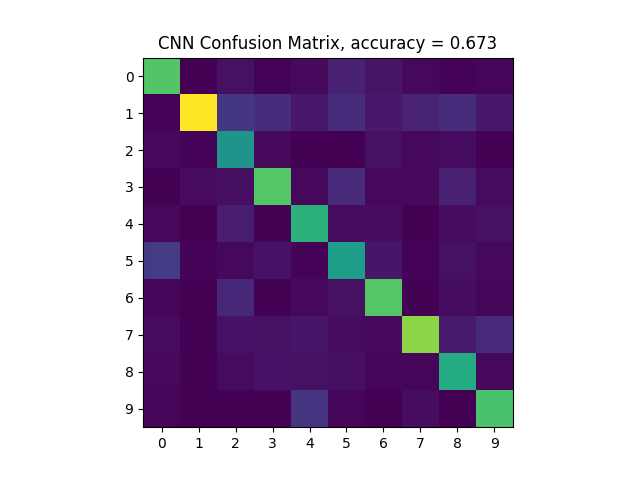
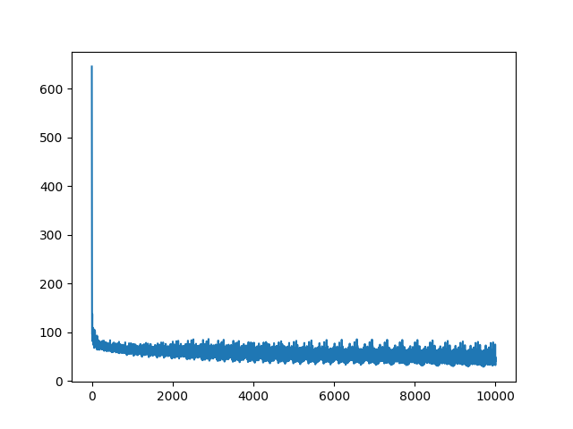

## MNIST Digit Recognition

 

Single Layer Linear Perceptron - Confusion Matrix and Loss curve
  

`Learning Rate: 0.09` `Decay Rate: 0.89` `Iterations: 2500`
 

 

Single Layer Perceptron - Confusion Matrix and Loss curve
  

`Learning Rate: 0.18` `Decay Rate: 0.89` `Iterations: 7500`
 

 

Multi Layer Linear Perceptron - Confusion Matrix and Loss curve
  

`Learning Rate: 0.16` `Decay Rate: 0.99` `Iterations: 15000`
 

 

Convolutional Neural Network - Confusion Matrix and Loss curve
  

`Learning Rate: 0.09` `Decay Rate: 0.9` `Iterations: 10000`
 

Done as part of the [CSCI 5561: Computer Vision](https://www-users.cse.umn.edu/~hspark/csci5561_F2020/csci5561.html) course requirements.
