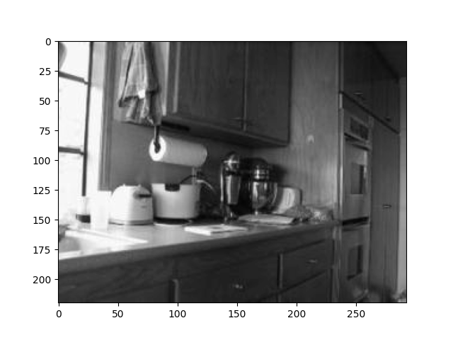
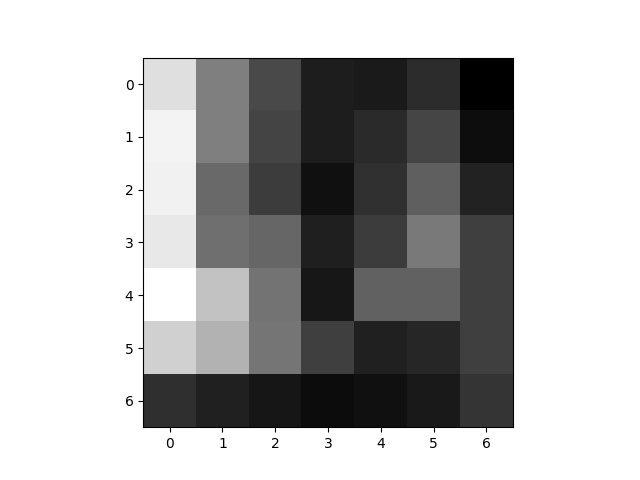
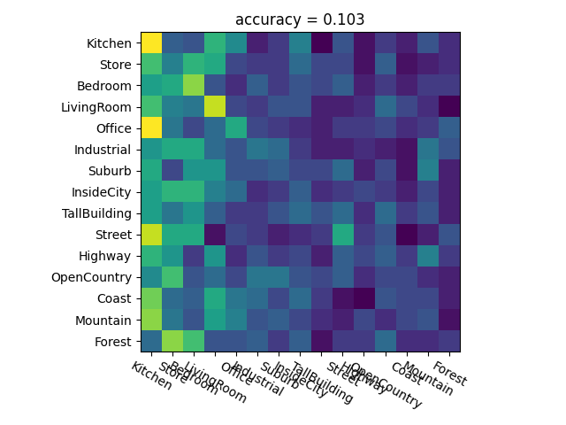
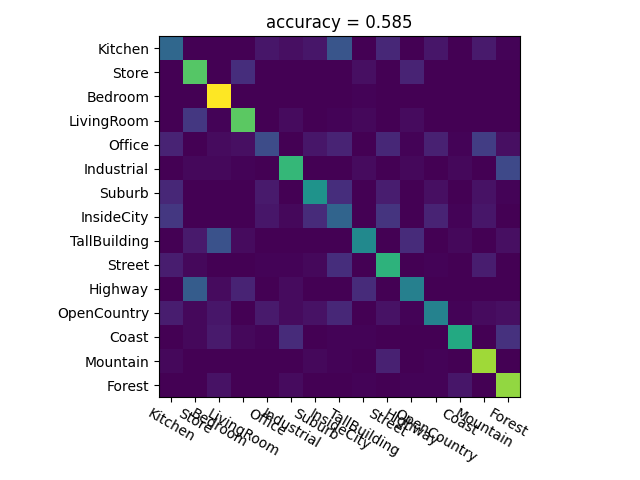

## Scene Recognition

 

Original Image and Tiny image conversion
  
 

  

Scene classification after converting the image into tiny image and using K-Nearest Neighbours for scene classification. [Accuracy = 10.3%] 
  
 

  

Scene classification after converting the images into a Bag of Visual Words (Bow) and K-Nearest Neighbours for scene classification. [Accuracy = 58.5%] 
  
 

  

Scene classification after converting the images into a Bag of Visual Words (Bow) and Support Vector Machine for scene classification. [Accuracy = 62.9%] 
  
 

Done as part of the [CSCI 5561: Computer Vision](https://www-users.cse.umn.edu/~hspark/csci5561_F2020/csci5561.html) course requirements.
