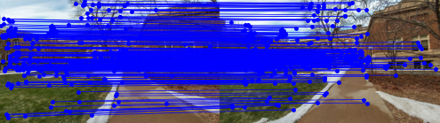
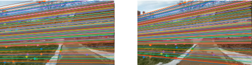
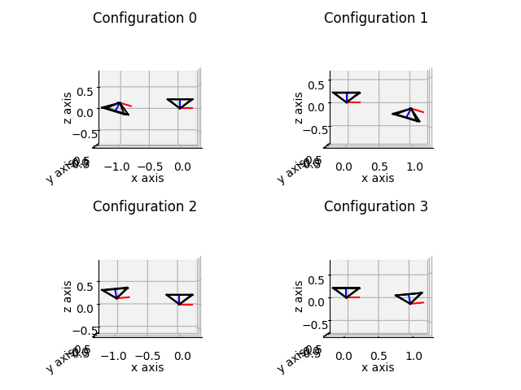
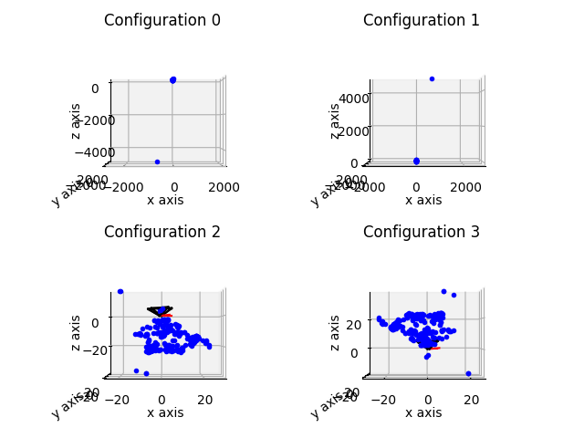
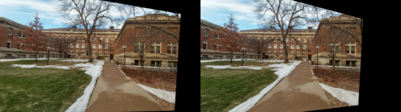
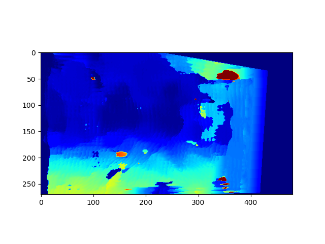

## Stereo Reconstruction

This project performs stereo reconstruction using a pair of stereo images, computes the SIFT descriptors, matches the SIFT features and computes the fundamental matrix (F) using 8-point RANSAC. Using the F matrix, the camera poses are computed. The reconstructed 3D points are calculated using triangulation. The best camera pose out of the possible poses using triangulation and then stereo matching is performed between the two views.

Original Left and Right images
  
 
   

SIFT Feature Matching and Epipolar lines
  
 
   

Camera Configuations computed from F along with PCL visualizations
  
 

<figure>
    
    
<figcaption>Stereo Rectification</figcaption>

</figure>

<figure>
    
    
<figcaption>Disparity Map of the stereo reconstruction</figcaption>

</figure>

Done as part of the [CSCI 5561: Computer Vision](https://www-users.cse.umn.edu/~hspark/csci5561_F2020/csci5561.html) course requirements.
